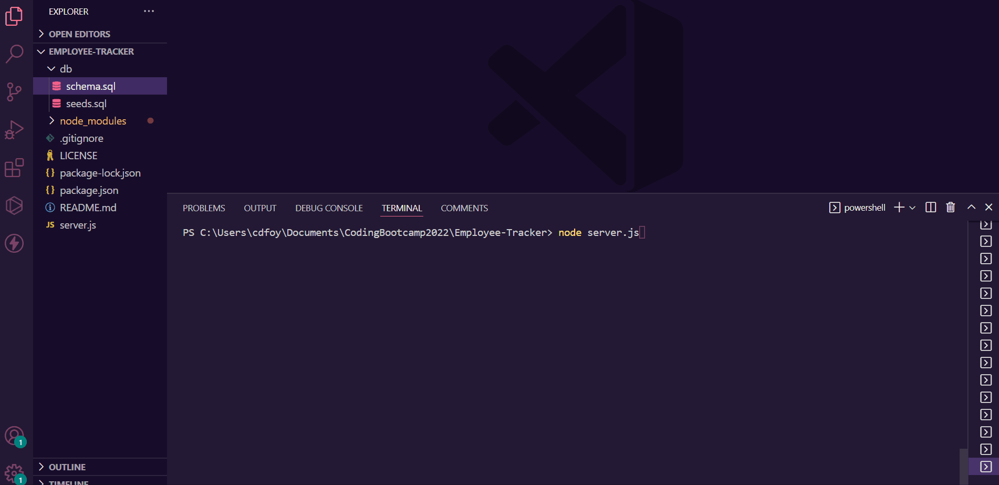

# Employee-Tracker

  

  ## Description
  A command-line application to manage your company's employee database.
  
  
  ## Table of Contents
  
  - [Installation](#installation)
  - [Usage](#usage)
  - [Contributing](#contributing)
  - [Tests](#tests)
  - [Questions](#questions)
  - [License](#license)
  
  ## Installation
  - Node.js will need to be installed prior to using this application
  - Clone the repository
  - Install node dependencies by running "npm i" on the command line
  - Start the application by running "node server.js" on the command line
  - Follow the prompts to view the database, add to the database, or exit the application
  
  
  
  ## Usage
  [Link to the Employee-Tracker repository](https://github.com/cdfoye/Employee-Tracker)

  The following example shows how to use this application:

  

  For a detailed walkthrough, click the link below to watch a tutorial:

  [Link to tutorial video](https://drive.google.com/file/d/1L2QNGVUVqwPzAHrrLhIid_SW0HHMUl12/view)

  
  
  ## Contributing
  Please reach out to me on Github or by email for contributions.
  
  
 ## Questions

  If you have any questions please visit my Github profile: [cdfoye](https://github.com/cdfoye)

  For additional questions you can email me at cdfoye@gmail.com
  
  ## License

  This application is covered under the MIT license